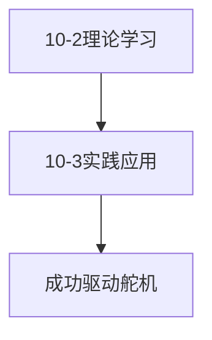
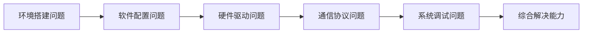

##  第一章：与STM32的初次相遇

### 任务目标
让STM32开发板上的LED小灯成功点亮

### 学习历程
| 时间   | 进展            | 状态  |
| ---- | ------------- | --- |
| 9.29 | 搭建开发环境，安装必备软件 |   |
| 9.30 | 解决注册机被拦截问题    | |
| 10.1 | 成功点亮LED灯      |   |

###  遇到的问题与解决方案
| 问题阶段       | 遇到的问题                        | 解决方案                                     | 经验收获                |
| ---------- | ---------------------------- | ---------------------------------------- | ------------------- |
| ** 环境搭建 ** | Windows Defender将注册机识别为病毒病拦截 | 1、暂时关闭实时保护 2、添加文件到排除项                    | 学会处理安全软件误报，理解软件授权机制 |
| 软件安装       | 多个开发工具配置复杂，依赖关系不明确           | 1.按照教程顺序安装<br>2.验证每个组件安装成功<br>3.测试环境变量配置 | 掌握嵌入式开发环境搭建的系统方法    |
| 首次编程       | 代码编译通过但LED不亮                 | 1. 检查硬件连接<br>2.验证GPIO配置<br>3.调试程序逻辑      | 建立硬件调试思维，学会系统排查问题   |

### 项目成果
>  克服了环境搭建的重重困难，成功完成第一个嵌入式项目，建立了解决问题的信心和方法论。

### 舵机控制
#### *深入PWM信号控制*
#### **学习轨迹**


### 遇到的问题与解决方案

| 问题阶段     | 遇到的问题                      | 解决方案                                    | 经验收获                     |
| -------- | -------------------------- | --------------------------------------- | ------------------------ |
| **原理理解** | PWM控制原理抽象，占空比与角度的关系不<br>理解 | 1.查阅多份技术文档<br>2. 观看视频演示<br>3.用示波器观察实际波形 | 深入理解PWM工作<br>机制，掌握信号分析方法 |
| **代码实现** | CubeMX生成的PWM代码无法直接<br>驱动舵机 | 1.分析舵机时序要求<br>2.调整定时器参数<br>3.重新计算占空比    | 学会根据外设特性调整驱动参数           |
| **运动控制** | 舵机运动不平稳，有抖动现象              | 1.优化电源供电<br>2. 添加软件消抖<br>3.调整PWM频率      | 掌握提高系统稳定性的实用技巧           |
### 项目成果
> 关键收获:从理论到实践的完整转化，掌握了定制化驱动开发的技能。

### 麦克纳姆轮

*探索全向移动技术*
#### 学习进展
##### **10-4** 原理学习与受力分析
#### 遇到的问题与解决方案
| 问题类型 | 理解难点                 | 解决方法                                                                                                                   | 学习收获         |
| ---- | -------------------- | ---------------------------------------------------------------------------------------------------------------------- | ------------ |
| 运动原理 | 四个轮子如何协同实现全向移动难以直观理解 | 1.分析群内技术文档                                      2.查阅学术论文                                                3.观看实际应用视频     | 掌握了向量合成分析方法  |
| 力学分析 | 受力分解复杂，运动方向判断困难      | 1.绘制受力分析图                                          2.建立数学模型                                               3.验证不同运动模式   | 建立了系统的力学分析思维 |
| 应用评估 | 与传统轮的优劣对比不清晰         | 1.列表对比特性                                                2.分析应用场景                                              3.总结适用条件 | 学会从多维度评估技术方案 |
#### 学习成果
> **关键发现：**麦克纳姆轮虽直行效率较低，但在空间受限场景中具有不可替代的优势，理解了工程中的权衡取舍。

### PS2控制器
 #### 攻克无线通信调试
 #### 调试历程
 ```mermaid
graph TD
    A[10-5 理论学习] --> B[10-6 编译错误]
    B --> C[10-7 更换教程编译成功]
    C --> D[10-8 解决烧录问题]
    D --> E[调试成功]
```
### 遇到的问题与解决方案
| 问题类型 | 理解难点               | 解决方法                                                                                                                       | 学习收获          |
| ---- | ------------------ | -------------------------------------------------------------------------------------------------------------------------- | ------------- |
| 理论学习 | PS2通信协议复杂，信号时序难以理解 | 1. 查阅协议文档                                              2. 分析时序图                                                  3. 理解握手流程 | 掌握了串行通信协议分析方法 |
| 编译错误 | 初次编译出现多处错误，库文件缺失   | 1. 检查头文件包含                                           2. 验证库路径配置                                           3. 发现教程版本不匹配     | 培养了技术方案评估能力   |
| 更换教程 | 原教程代码与硬件不兼容        | 1. 寻找新的教程资源                                          2. 对比多个方案优劣                                         3. 选择最适合的方案       | 培养了技术方案评估能力   |
| 烧录问题 | 编译成功但烧录失败，程序无法运行   | 1. 检查STLink连接                                          2. 验证芯片型号配置                                       3. 调整烧录参数设置       | 掌握了硬件调试的完整流程  |
| 最终调试 | 部分功能不正常，响应不稳定      | 1. 逐功能测试验证                                           2. 优化代码逻辑                                              3. 最终完全调试成功    | 建立了系统化的问题定位思维 |
#### 项目成果
>**关键收获：经历了完整的"理论→实践→问题→解决→成功"循环，培养了面对复杂问题的耐心和系统解决能力。
># 学习总结
#### 问题解决能力成长


### 技术能力提升轨迹

| 能力维度 | 起点水平  | 提升过程              |
| ---- | ----- | ----------------- |
| 环境搭建 | 完全陌生  | 克服注册机拦截、软件配置问题    |
| 硬件调试 | 理论了解  | 经历LED、舵机、PS2的完整调试 |
| 问题解决 | 依赖教程  | 建立系统化的问题分析方法      |
| 协议理解 | 概念性认识 | 深入分析PWM、PS2等通信    |


### 核心成长体会
>作为一名大一新生，这次STM32的学习之旅真的让我受益匪浅！从最初连软件都装不顺利的小白，到后来能独立完成点灯、控制舵机这些“神奇”的操作，每一个小小的成功都让我特别有成就感。
